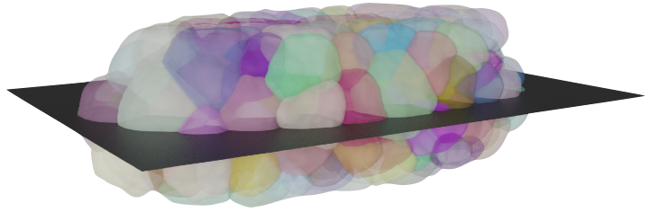

<h1 align="center">IO tools for biomedical images</h1>
A collection of tools for processing biological or medical images.

<!-- toc -->
- [3D Segmentation Rendering](#3D-segmentation-render)
- [Overlap heatmap color](#Overlay-Heatmap)
<!-- tocstop -->

## 3D Segmentation Render

 This section includes steps with which we render the 3D segmentation results of [CShaper](https://www.nature.com/articles/s41467-020-19863-x).
This is a customized framework to display our work but it maybe also valuable for showing other kinds of data.

 Generally speaking, multiple softwares or applications are involved in rendering the result. The data flow
 follows <code>*.nii.gz</code> --> <code>*.tif</code> --> <code>*.obi</code>/<code>*.mtl</code> --> <code>*.png</code>, Specifically, 

1. Save segmentation (here `*.nii.gz`) as indexed tiff image. (Code: [`save_indexed_tif`](./utils/utils.py))

2. 
 Use <a href="https://fiji.sc">Fiji</a> plugin to extract 3D framework (<code>*.obi</code>) of the segmentation. If only one image needs to be be processed, the segmentation can be manually import and rendered with <code>Plugins|Process|Show color surface</code>; If a bunch  of images are required, the <code>Macros</code> would be helpful. (Code: <a href="./draw3DSnap.ijm"><code>draw3DSnap.ijm</code></a>)

3. 
 The <a href="https://www.blender.org">blender</a> can import <code>*.obj</code> and even support user defined python script. Also, the python script can be used to process multiple images automatically. (Code: <a href=./utils/blender_render.py>blender_script</a>)
 

Example,

## Overlay Heatmap
A transparent color map is overlaied on the raw image. For details, please refer to [HeatMap](https://github.com/LinShanify/HeatMap). (Code: [`Heatmap.py`](./utils/heatmap.py))

